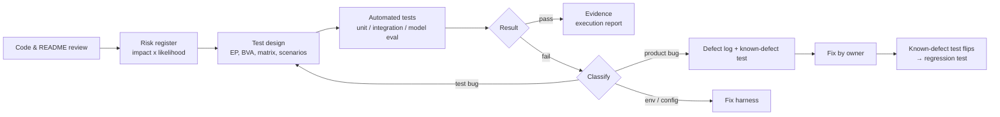
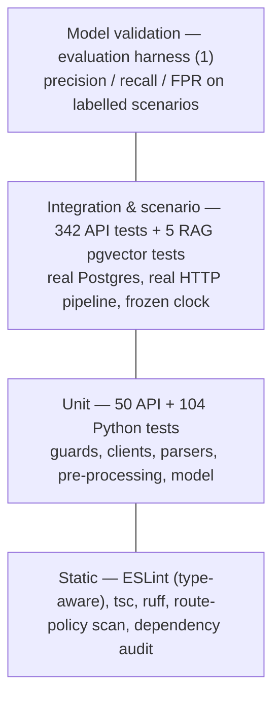
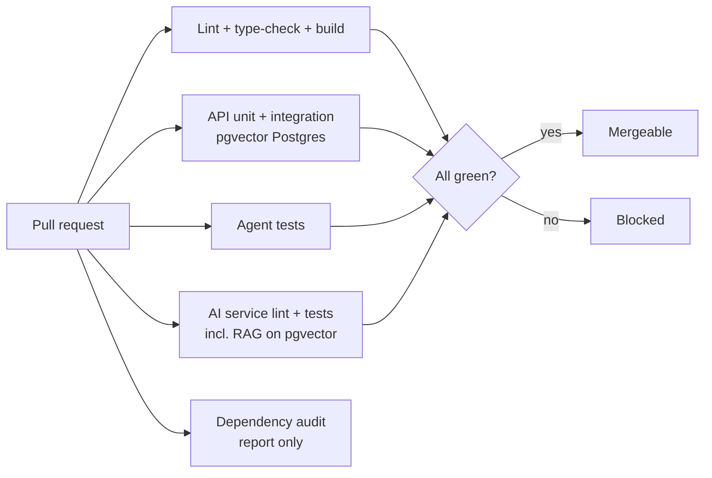

# InfraSentinel — Software Quality Assurance Plan

| | |
|---|---|
| Owner | Hashim Ahmad (SQA) |
| Version | 1.1 — 2026-10-06 (status of each objective on `team-dev` added; 1.0 — 2026-09-30) |
| Baseline | cycle 1: `develop` @ `c1f7b6a` (2026-09-11); now: `team-dev` with the approved fixes |
| Related | [Risk register](RISK_REGISTER.md) · [Traceability](TRACEABILITY_MATRIX.md) · [Defect log](DEFECT_LOG.md) · [Execution report](TEST_EXECUTION_REPORT.md) |

## 1. What SQA means for InfraSentinel

InfraSentinel is a **multi-tenant security product**: organizations trust it with
their telemetry, and trust its alerts to tell them when they are under attack. Two
failure classes therefore matter more than anything else:

1. **Trust failures** — one tenant sees or changes another tenant's data, or a user
   gets more power than their role allows. For a security product this is fatal.
2. **Detection failures** — the SIEM stays silent during an attack (false negative)
   or cries wolf (false positive). Both destroy the product's value.

We separate the two parts of SQA:

- **Quality assurance** is the *process*: risk analysis, deciding what to test and
  how deeply, standards (lint, types), CI gates, defect management, traceability.
- **Testing** is one *activity* inside it: executing checks and recording evidence.

The first QA finding was a process defect, not a code defect: tests existed but CI
never ran them, and CI did not run on `team-dev` at all (DEF-32, now fixed on `team-dev`).

## 2. Scope

| In scope (this phase) | Deferred / out of scope — and why |
|---|---|
| NestJS API: auth, RBAC, organizations, servers, ingestion, rules, rule engine, incidents, anomaly + RAG proxies, middleware | **Frontend E2E** — the UI is being redesigned on `team-dev`; UI tests written now would be rewritten. One UI defect is recorded from code review (DEF-11). |
| Python monitoring agents (metrics, SSH/sudo parser) | **Load/performance execution** — no production-like environment yet (see [PERFORMANCE_TESTING.md](PERFORMANCE_TESTING.md)); plan and criteria defined. |
| AI service: pre-processing, LSTM, training, inference, RAG, HTTP API | **Penetration testing of hosted infrastructure** (Neon, cloud) — outside the FYP's authority. |
| CI pipeline, dependency and secret hygiene | |

## 3. Quality objectives and acceptance criteria

| ID | Objective | Acceptance criterion (measurable) | Cycle 1 (`develop`) | `team-dev` (2026-10-06) |
|---|---|---|---|---|
| Q1 | Tenant isolation | Every TENANT-, SIEM tenant-scope and RAG-I test passes; 0 open Critical/High isolation defects | **Not met** — DEF-04, DEF-05 open | **Met** — all pass; DEF-04, DEF-05, DEF-08, DEF-24 fixed |
| Q2 | Authorization | Every RBAC matrix case passes (126 on `develop`, 120 on `team-dev`); route-policy scan passes; role hierarchy enforced | **Partly met** — matrix passes, hierarchy fails (DEF-03) | **Met** — 120/120, scan passes, DEF-03 fixed |
| Q3 | Authentication | All token-forgery cases rejected; refresh rotation; brute-force throttling | **Partly met** — forgery rejected; DEF-12, DEF-13 open | **Partly met** — DEF-12 partly fixed, DEF-13 open |
| Q4 | Detection correctness | Every rule type fires exactly at documented boundaries, once per condition, and again after resolution | **Partly met** — boundaries/de-dup pass; DEF-06, DEF-15, DEF-16 open | **Met** in automated tests — DEF-06, DEF-15, DEF-16 fixed, plus DEF-47..DEF-51 found and fixed; live re-run pending |
| Q5 | Input robustness | Invalid input → 4xx and nothing stored; no 5xx from client input | **Partly met** — BVA/EP pass; DEF-20, DEF-23 give 500s | **Partly met** — DEF-20 fixed; DEF-23 still gives a 500 |
| Q6 | Anomaly-detection quality | Window-level F1 ≥ 0.85 and false-positive rate ≤ 5% on the reproducible benchmark | **Met** — F1 0.914, FPR 3.7% (synthetic data) | **Met** — same results; the team's trained models still need DEF-54 resolved |
| Q7 | Regression safety | Every PR runs all suites; failing tests block merge | **Ready** — pipeline written; branch protection is a team decision | **Ready** — pipeline on `team-dev`, first run on push; branch protection is a team decision |

Criteria come from the README's own claims where possible (e.g. "one tenant's
incidents are never retrievable by another") so results are judged against what the
team promised, not against the tester's opinion.

## 4. Strategy: risk-based testing

Testing effort is proportional to **risk = impact × likelihood**
([RISK_REGISTER.md](RISK_REGISTER.md)). Tenant isolation, authorization and detection
correctness scored highest, so they received integration tests against a real
database; low-risk code (e.g. the "Hello World" controller) received none beyond
what already existed.

## 5. Test levels (the testing pyramid for this system)

| Level | Verifies | InfraSentinel example | Why this level |
|---|---|---|---|
| Static | code properties without running it | route-policy scan fails the build if an endpoint has no auth guard | cheapest; catches whole bug classes |
| Unit | one component in isolation, collaborators replaced | `RolesGuard`, SSH log parser, sliding-window builder | fast, precise failure location |
| Integration | components together with real infrastructure | Org A's OWNER calls every endpoint with Org B's IDs against a real database | isolation lives in SQL `WHERE` clauses — a mock cannot prove them |
| Scenario / system | behaviour over time and across modules | "5 failed logins from one IP within 300 s → exactly one alert" | SIEM correctness is temporal |
| Model validation | statistical quality of the ML model | injected-anomaly benchmark with a confusion matrix | pass/fail unit tests cannot say *how good* a model is |
| E2E (UI) | the user journey in a browser | deferred (UI redesign in progress) | — |

A concrete reason both unit **and** integration levels are needed: the request-logging
middleware's unit tests pass, yet the integration tests show that on the real Fastify
platform every logged path is `"/"`, so its exclusion list never works (DEF-34).

## 6. Test design techniques

| Technique | Where used |
|---|---|
| Equivalence partitioning | invalid telemetry types (string, null, boolean, array, missing) — METRIC-010 |
| Boundary value analysis | CPU −0.01/0/100/100.01; password 7/8 chars; threshold 80 vs 80.01; heartbeat 120 s vs 121 s; 4 vs 5 failures; 2 vs 3 IPs; sudo at 08:59/09:00/17:59/18:00; 19 vs 20 readings |
| Positive and negative testing | every denial test has a matching "allowed" control (RBAC-010, TENANT-002, RAG-I02) |
| Positive controls | a test that asserts "no alert" is paired with one proving alerts *can* fire; otherwise a dead engine passes |
| Decision table / matrix | 20 endpoints × 6 roles authorization matrix on `team-dev`, 21 on `develop` (RBAC-001) |
| State transition | incident OPEN → INVESTIGATING → RESOLVED (INC-010..012) |
| Scenario / timeline | SIEM rules evaluated against seeded event timelines with a frozen clock |
| Adversarial design | in RAG-I01 Org B's incident is the *nearest* vector to Org A's question |
| Fault injection | AI service down, erroring, hanging; LLM outage; API unreachable from the agent |
| Security attack cases | forged signature, `alg:none`, tampered payload, expired and cross-purpose tokens, IDOR, mass assignment |

## 7. Tools and rationale

Legend: **[Std]** standard QA practice · **[Sec]** security-platform practice ·
**[Ind]** inspired by comparable platforms · **[IS]** chosen for InfraSentinel's architecture.

| Tool / practice | Why | Tag |
|---|---|---|
| Jest + ts-jest | already the project's test runner; no new framework to learn | Std |
| Fastify `inject()` | exercises guards, pipes and middleware in-process on the production HTTP platform | Std |
| PGlite (PostgreSQL + pgvector in WebAssembly) | real Postgres on developer laptops with no Docker install; same migrations as production | IS |
| `pgvector/pgvector:pg16` service in CI | integration tests also run on the official engine | Std |
| pytest | standard Python runner for agent and AI service | Std |
| Frozen clock (fake `Date` only) | exact, repeatable time windows — like `promtool test rules`' evaluation time | Ind |
| Known-defect tests (`it.failing`, `xfail(strict)`) | defects stay visible in CI without blocking unrelated work; a fix flips the test | Std |
| Route-policy scan | "policy as code": every new endpoint must be guarded | Sec |
| Evaluation harness with injected anomalies | labelled benchmark for an unsupervised model — like replaying attack datasets | Ind |
| pnpm audit / pip-audit | known-vulnerable dependencies are a top risk for a security product | Sec |

Deliberately **not** added: Playwright/Cypress (UI in flux), k6 (no representative
environment yet), SonarQube, Postman collections — each would add tooling without
adding evidence at this stage.

## 8. Test environment and data

- **Isolation**: every integration run gets a fresh, migrated database; each test
  truncates and re-seeds. A guard refuses to run against cloud hosts (Neon, AWS,
  Supabase), so the shared development database can never be damaged.
- **Secrets**: tests use obviously fake JWT secrets; the AI service URL points at a
  closed port so no test reaches a real model or paid LLM API.
- **Determinism**: seeded random data, frozen clock for time-window tests, scheduler
  disabled (the rule engine is invoked directly). Suites were run repeatedly to detect
  flakiness; one flaky test was found and redesigned in cycle 1 (INC-006).
- **Synthetic telemetry**: healthy-server data with seasonality and noise; anomalies
  injected at known positions so every sample has a ground-truth label.

## 9. Entry and exit criteria

**Entry** (before testing a change): it builds, lints and type-checks; migrations
apply; the behaviour has an acceptance criterion (README claim, issue, or this plan).

**Exit** (before merging `develop` into `main`):
1. All suites green in CI (known-defect tests allowed only for logged, triaged defects).
2. No open **Critical** or **High** defect in tenant isolation, authorization or authentication.
3. New endpoints appear in the RBAC matrix and pass the route-policy scan.
4. Coverage does not drop without a stated reason (coverage is evidence, not a target).

## 10. Defect management

**Lifecycle**: New → Confirmed (reproduced by an automated test) → Assigned → Fixed →
Verified (known-defect test now passes and is converted to a regression test) → Closed.
Alternatives: Rejected (not a defect / by design) or Deferred (accepted risk, documented).

**Severity** (defined for this product):

| Severity | Meaning in InfraSentinel | Example |
|---|---|---|
| Critical | exploitable now; compromises all data or allows remote code execution | DB password in public history (DEF-01) |
| High | breaks tenant isolation, privilege boundaries, or a detection capability | ADMIN can become OWNER (DEF-03) |
| Medium | wrong behaviour with limited impact or a workaround; reliability gaps | no login throttling (DEF-13) |
| Low | wrong status codes, cosmetics, maintainability | invalid API key returns 404 not 401 (DEF-21) |

**Classification** — every failure is classified before anything is "fixed":

| Class | Example from this project |
|---|---|
| Product bug | mass assignment moves a rule into another tenant (DEF-04) |
| Test bug | RAG-I01 asserted "payroll" never appears — but the *question* contained it; fixed the assertion |
| Test design (flaky) | INC-006 depended on query ordering; redesigned to assert call order |
| Environment | Git on Windows rejected the long clone path; `pnpm` not on PATH |
| Configuration | ruff run from the repo root mis-classified first-party imports |
| Documentation | correlation code comment promises a 5-minute window that does not exist (DEF-17) |

**Responsible disclosure**: the repository is public. Security defects are reported
privately to the team lead first; credential details never appear in public files or issues.

## 11. CI quality gates

Blocking: lint, build, all test suites. Report-only (until triaged): dependency audit.
Recommended team setting: branch protection on `develop` and `main` requiring these checks.

## 12. Roles

| Role | Responsibility |
|---|---|
| SQA (Hashim) | plan, risk register, test design and automation, CI gates, defect log, evidence, reporting |
| Developers (Saad, Farhan, …) | fix defects in their modules; keep tests green; add tests with new features |
| Team lead | triage severity disputes, approve risk acceptance, handle credential rotation |

## 13. Limitations

- ML results use synthetic telemetry; real-world precision/recall needs labelled incidents.
- PGlite is real PostgreSQL but single-process; performance numbers from it are not representative.
- Frontend behaviour is covered only by code review in this phase.
- The LLM's answer quality (hallucination rate) is not measured; we test the controls around it (grounding instruction, empty-context refusal, tenant filtering).
